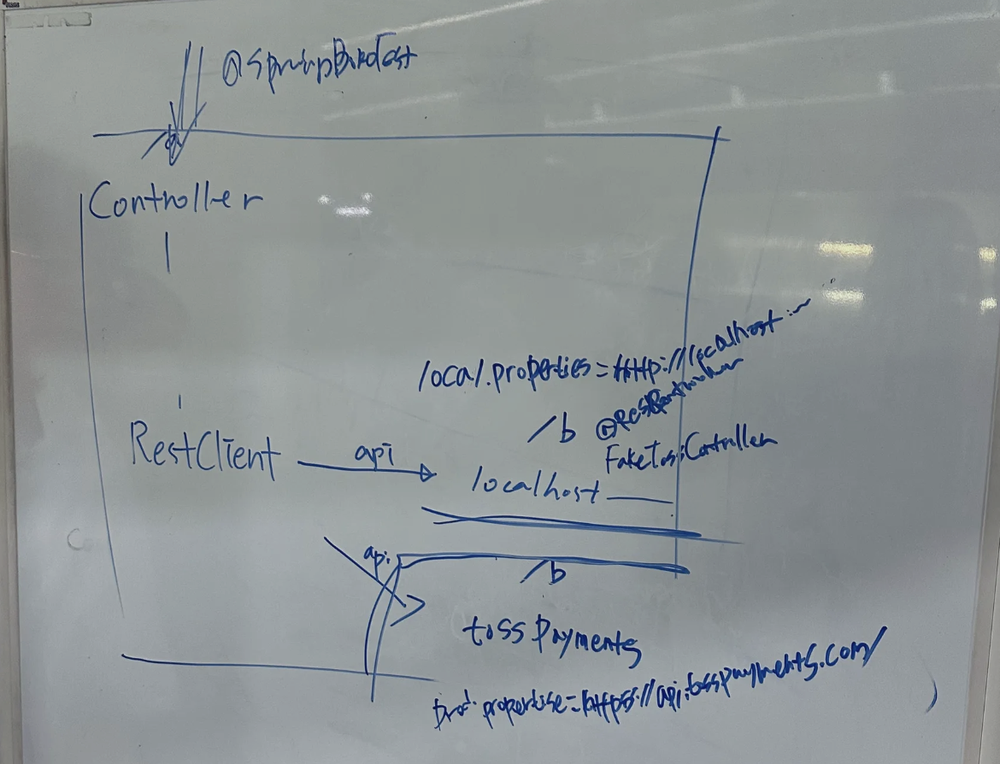
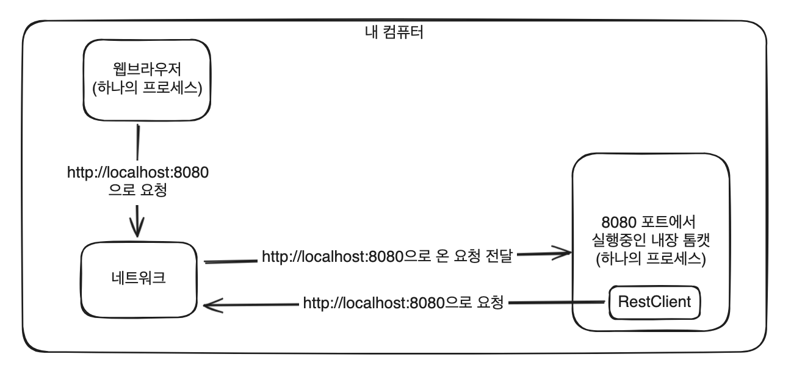

# 스프링부트에서 외부 API 테스트하기

### 대상 독자

<p>

1. 스프링부트에서 외부 API를 호출해보신 분
2. `@SpringBootTest`를 사용해보신 분
3. 테스트에 관심이 많으신 분
</p>

***

### 글을 쓰게 된 계기

<p>

우아한테크코스 코치님이신 제이슨이 여러 크루들 앞에서 재밌는 퀴즈를 냈습니다.
```
지난 미션 중에 토스의 API를 활용하는 부분이 있었죠. 위 그림과 같이 테스트 환경을 구성하면, 외부 API 테스트가 가능할까요?
```

이미지의 상황을 이해해보겠습니다. prod 환경에서 `RestClient`는 토스 서버를 바라보고 있습니다. 클라이언트-서버 구조에서 우리의 서버는 클라이언트이고, 토스가 서버입니다. 우리는 `RestClient`가 토스 서버와 요청과 응답을 잘 주고받는지 테스트하고 싶습니다. 하지만 테스트 코드에서 실제로 토스 서버에게 요청을 보내도록 만들면, 우리 서버에 대한 테스트 코드인데 토스 서버의 안정성에 의존해야 한다는 문제가 있습니다. 따라서 `application.yml`을 적절히 설정하여 test 환경에서는 `RestClient`가 localhost를 바라보도록 만듭니다. 그리고 `FakeTossController`라는 테스트용 컨트롤러를 만들어서, `RestClient`가 localhost로 보내는 요청을 처리할 수 있도록 구성합니다. 자, 이제 테스트가 가능할까요?

</p>
<p>


여기저기 헛다리를 짚는 크루들을 보고 제이슨이 힌트를 줬습니다. 
```
`@SpringBootTest`의 기본 설정은 무엇인가요?                       
```
어떤 크루가 대답했습니다.
```
MOCK 입니다!
```
제이슨이 물었습니다.
```
그럼 서블릿 컨테이너가 뜰까요?
```

아! 저는 이 때 서블릿 컨테이너가 무엇인지 몰랐습니다. 그래서 자연스럽게 뒤따라오는 내용은 이해하지도 못했고, 기억도 안 납니다. 분명 이전 과제에서 토스 API를 포함하는 로직에 대해 테스트 코드를 작성한 경험이 있는데, 시간이 부족하다는 핑계로 여기저기 블로그에서 돌아다니는 코드와 ChatGPT가 알려준 코드를 조합해서 제출했던 것으로 기억합니다. 

이에 경각심을 느껴 다시 공부해보고자 합니다. 저와 함께 외부 API 테스트를 고민해보면서, 자연스럽게 서버가 요청을 처리하는 과정까지 이해해보시죠!


</p>

***

### `@SpringBootTest`의 webEnvironment
<p>

우선 `@SpringBootTest`가 MOCK 설정일 때, 서블릿 컨테이너가 뜨는가? 라는 질문을 이해해보겠습니다. `@SpringBootTest`는 다음과 같은 4가지 webEnvironment를 선택할 수 있습니다.
- MOCK
- RANDOM_PORT
- DEFINED_PORT
- NONE

DEFINED_PORT에 대한 설명을 먼저 살펴보겠습니다.

> Loads an EmbeddedWebApplicationContext and provides a real servlet environment. Embedded servlet containers are started and listening on a defined port (i.e from your application.properties or on the default port 8080).

 임베디드 애플리케이션 컨텍스트를 로드해서 실제 서블릿 환경을 제공한다는 게 무슨 뜻일까요? 
 
 먼저 스프링부트 애플리케이션을 단순하게 실행시키는 과정을 이해해보겠습니다. 스프링을 공부해보신 분들이라면, `http://localhost:8080`이라는 URL로 GET 요청을 보내서 웹브라우저 상에 hello world!를 띄워보신 경험이 있으실 겁니다. 스프링 애플리케이션의 main 메서드를 실행시키면 우리의 컴퓨터는 다음과 같은 과정을 거칩니다.
1. 스프링부트 애플리케이션의 내장 톰캣을 하나의 프로세스로 실행시킵니다.
2. 네트워크 요청을 받아야 하는 프로세스이므로, 8080 포트를 할당합니다.

이 때 내장 톰캣이 수행하는 역할 중 하나가 바로 서블릿 컨테이너입니다. 즉 실제 서블릿 환경을 제공한다는 뜻은 내장 톰캣을 띄운다는 말과 큰 차이가 없습니다. 

서블릿과 서블릿 컨테이너의 개념이 생소하실 수 있습니다. 스프링 애플리케이션은 `DispatcherServlet`이라는 서블릿 하나만이 서블릿 컨테이너에 등록되어 있고, 내장 톰캣으로 들어오는 모든 Http 요청이 `DispatcherServlet`을 거쳐서 우리의 컨트롤러로 전달된다는 점만 이해하셔도 충분합니다. 

다음으로, 아래 그림과 함께 `RestClient`의 요청이 처리되는 과정을 이해해보겠습니다.

그림과 같이 웹브라우저가 보내는 요청이든, `RestClient`가 보내는 요청이든 네트워크 입장에서는 요청을 `http://localhost:8080`이라는 목적지로 전달해준다는 점에서 큰 차이가 없습니다. 따라서 `RestClient`가 `http://localhost:8080`으로 요청을 보내면 네트워크를 거쳐 부메랑처럼 요청이 돌아오는 모습을 볼 수 있습니다. 

만약 `@SpringBootTest`의 webEnvironment에서 DEFINED_PORT 옵션을 사용한다면 8080 포트에 내장 톰캣이 띄워져 있으므로 부메랑처럼 돌아오는 `RestClient`의 요청이 `DispatcherServlet`을 거쳐 `FakeController`에게 전달되고, `FakeController`의 응답은 다시 네트워크를 거쳐 부메랑처럼 `RestClient`에게 전달됩니다. 

`@SpringBootTest`의 webEnvironment를 MOCK 또는 NONE으로 설정하여 8080 포트에 내장 톰캣이 띄워지지 않았다면 어떻게 될까요? `RestClient`의 요청은 존재하지 않는 서버에게 날린 꼴이기 때문에 네트워크로부터 오류 응답을 받게 됩니다.

***
### `RestClient` 예제 코드
<p>

`FakeController`를 활용해서 정말 위 그림과 같이 외부 API 테스트가 가능한지 직접 실험해보겠습니다. `RestClient`를 사용한 아주 간단한 예제를 아래에서 확인해봅시다.

```java
@Component
public class TodoClient {

    private final RestClient restClient;

    public TodoClient(
            @Value("${todo-base-url}") // application.yml에 정의한 값
            String baseUrl,
            RestClient.Builder builder // RestClient.Builder는 ApplicationContext에 빈으로 등록되어 있어서 생성자 주입 가능
    ) {
        this.restClient = builder.baseUrl(baseUrl).build(); 
    }

    public TodoResponse getTodoById(Long id) {
        return restClient.get()
                .uri("/todos/{id}", id) // baseUrl 뒤에 이 값을 붙여서 최종 URL 완성
                .retrieve()
                .onStatus(status -> status.value() == 404, (req, res) -> {
                    throw new TodoException.NotFound(id);
                })
                .onStatus(status -> status.value() == 500, (req, res) -> {
                    throw new TodoException.InternalServerError(id);
                })
                .body(TodoResponse.class); // 응답으로 받은 JSON을 DTO로 맵핑
    }
}

```

외부 서버에 API 요청을 보냈을 때, 다양한 예외가 발생할 수 있습니다. 사용자가 요청한 자원을 외부 서버에서 찾지 못할 경우(상태코드 404)와 외부 서버에서 내부적인 에러가 발생한 경우(상태코드 500)만 구분해서 커스텀 예외를 던지는 방식으로 간단히 구현했습니다.
```java
public class TodoException extends RuntimeException {
    public TodoException(String message) {
        super(message);
    }

    public static class NotFound extends TodoException {
        public NotFound(Long id) {
            super("Todo not found with id: " + id);
        }
    }

    public static class InternalServerError extends TodoException {
        public InternalServerError(Long id) {
            super("Server error while fetching Todo with id: " + id);
        }
    }
}

```
`${todo-base-url}`은 application.yml에 아래와 같이 적어주었습니다.
```
todo-base-url: http://jsonplaceholder.typicode.com 
```

응답용 DTO는 record를 사용해서 간단하게 구성해봅시다.
```java
public record TodoResponse(long userId, long id, String title, boolean completed) {
}
```
***
### 무엇을 테스트할 것인가?
<p>

`FakeController`를 활용한 테스트 코드를 알아보기 전에, 먼저 우리가 테스트 코드를 통해 확인하고 싶은 사항이 무엇인지 정리해봅시다. `TodoClient는 문제없이 작동합니다!` 라고 주장하기 위해서는 아마 다음과 같은 테스트가 필요할 것입니다.
1. 외부 서버로부터 API 스펙에 맞게 body를 받으면 `TodoResponse`라는 DTO로 변환시킬 수 있다.
2. 외부 서버로부터 404 상태코드를 응답받으면 `TodoException.NotFound` 예외를 던진다.
3. 외부 서버로부터 500 상태코드를 응답받으면 `TodoException.InternalServerError` 예외를 던진다.

앞서 생각해둔 방식처럼 `@SpringBootTest`에서 테스트용 내장 서버를 8080포트에 띄워서 테스트 해봅시다.

</p>

***

### `@SpringBootTest`에서 테스트용 내장 서버를 활용하기
<p>

`@SpringBootTest`의 webEnvironment를 DEFINED_PORT로 설정하면 8080포트로 테스트용 내장 서버를 손쉽게 띄울 수 있습니다. 

```java
@SpringBootTest(webEnvironment = WebEnvironment.DEFINED_PORT) // 8080 포트로 테스트용 내장 서버를 띄웁니다.
public class TodoClientTest {

    @Autowired
    private TodoClient todoClient; // TodoClient는 빈으로 등록되어 있으므로 주입 가능

    @DisplayName("id로 todo를 검색한다.")
    @Test
    void getTodoById() {
        // given
        Long id = 1L;

        // when
        TodoResponse response = todoClient.getTodoById(id);

        // then
        assertAll(
                () -> assertThat(response.userId()).isEqualTo(1L),
                () -> assertThat(response.id()).isEqualTo(1L),
                () -> assertThat(response.title()).isEqualTo("테스트용 타이틀"),
                () -> assertThat(response.completed()).isTrue()
        );
    }
}

```
위 테스트 코드를 통과시키기 위해선 두 가지의 추가 설정이 필요합니다.

1. test 패키지의 `application.yml`에 아래와 같이 적어줍니다.
```
base-url: http://localhost:8080
```
위와 같은 설정이 필요한 이유는 무엇일까요? 앞서 함께 봤던 `TodoClient`의 생성자를 다시 봅시다.

```java
@Component
public class TodoClient {

    private final RestClient restClient;

    public TodoClient(
            @Value("${todo-base-url}") // application.yml에 정의한 값
            String baseUrl,
            RestClient.Builder builder // RestClient.Builder는 ApplicationContext에 빈으로 등록되어 있어서 생성자 주입 가능
    ) {
        this.restClient = builder.baseUrl(baseUrl).build(); 
    }

    public TodoResponse getTodoById(Long id) {
        return restClient.get()
                .uri("/todos/{id}", id) // baseUrl 뒤에 이 값을 붙여서 최종 URL 완성
                .retrieve()
                .onStatus(status -> status.value() == 404, (req, res) -> {
                    throw new TodoException.NotFound(id);
                })
                .onStatus(status -> status.value() == 500, (req, res) -> {
                    throw new TodoException.InternalServerError(id);
                })
                .body(TodoResponse.class);
    }
}

```

`TodoClient`를 빈으로 등록할 때, baseUrl은 `application.yml`에 정의된 값이 주입됩니다. 스프링부트는 스프링컨테이너를 구성할 때, main의 `application.yml`과 test의 `application.yml`을 구분해서 사용합니다. 따라서 테스트용 스프링컨테이너에 `TodoClient`를 빈으로 등록할 때는 baseUrl이 실제 외부 서버의 URL을 바라보지 않고 localhost:8080을 바라보도록 설정할 수 있습니다. 덕분에 `TodoClient`는 테스트용 내장 서버를 바라보고 요청을 보낼 수 있게 되었습니다. 예를 들어 `todoClient.getTodoById(1)`을 호출하면 `GET http://localhost:8080/todos/1`이라는 Http 요청이 전송될 것입니다. 그러나 아직까지 우리의 테스트용 내장 서버는 위 요청을 처리할 컨트롤러가 없습니다. 다음 과정으로 넘어가봅시다.

2. `FakeTodoController`를 만들어서 빈으로 등록합니다.

```java
@RestController
@RequestMapping("/todos")
public class FakeTodoController {

    @GetMapping("/{id}")
    public Map<String, String> getById(@PathVariable Long id) {
        Map<String, String> map = new HashMap<>();
        map.put("userId", "1");
        map.put("id", "1");
        map.put("title", "테스트용 타이틀");
        map.put("completed", "true");
        return map;
    }
}
```

`FakeTodoController`는 Map을 반환합니다. `@RestController`에 포함되어 있는 `@ResponseBody` 덕분에 Map은 JSON 형태로 변환되어 HttpResponse의 body에 담기게 됩니다. 이 때 `FakeTodoController`가 Map이 아니라 앞서 만들어둔 `TodoResponse`라는 DTO를 반환하고, `RestClient`도 같은 DTO를 받도록 만들면 어떻게 될까요? 해당 DTO의 필드명이나 타입이 API 스펙과 다르게 적혀있더라도 테스트 코드는 통과할 것입니다. 하지만 실제 운영환경에서는 문제가 발생하겠죠. 외부 서버가 실제 보내줄 JSON 값이 우리의 DTO와 항상 대응할 것이라 가정하고 `FakeController`를 작성했기 때문입니다. 따라서 외부 서버가 API 응답으로 보내주는 스펙에 맞게 `FakeController`에서 반환하는 Map의 key, value값을 정확하게 기입해주는 것은 생각보다 더 중요한 작업이라고 볼 수 있습니다.

</p> 

<p>

여기까지 `@SpringBootTest`의 내장 톰캣을 활용해서 외부 API를 테스트하는 방법에 대해 알아봤습니다. 긴 호흡으로 설명드렸지만, 사실 위 방법은 테스트용 내장 서버를 실제로 띄워야 한다는 것 자체에서 큰 단점을 안고 있습니다. 테스트 코드를 실제로 실행해보면 테스트용 내장 서버를 띄운 경우엔, 그렇지 않은 경우보다 훨씬 오래 걸린다는 사실은 익히 아실 겁니다. 만약 매 테스트 메서드마다 애플리케이션 컨텍스트를 새로 생성하는 `@DirtiesContext` 옵션까지 사용한다면 더 느려지겠죠. 따라서 내장 톰캣을 띄우지 않고 테스트하는 방법이 있다면, 이를 선택하는 것이 합리적입니다.

</p>

***

### @RestClientTest
<p>

감사하게도 스프링에서는 내장 톰캣을 띄우지 않고도 외부 API 요청을 테스트할 수 있도록 `@RestClientTest`라는 기능을 제공합니다. 이는 `RestClient`가 보내는 HttpRequest를 `MockRestServiceServer`라는 Mock서버가 가로채서 대신 응답해주는 방식으로 외부 API 테스트를 지원합니다. Mock서버는 실제 서버가 아니므로 어떤 요청을 받을 지, 그리고 요청에 대해 어떤 응답을 내보낼 지에 대해 직접 정의해줘야 합니다. 아래의 코드를 주석과 함께 확인해보시면 쉽게 이해하실 수 있습니다.

```java
// value에 테스트 대상을 등록합니다. 
// 단, RestTemplateBuilder 또는 RestClient.Builder에 의존하는 빈만 가능합니다.
@RestClientTest(value = TodoClient.class) 
class TodoClientTest {

    @Autowired
    private TodoClient todoClient; // 위에서 빈으로 등록해줬기 때문에 주입 가능

    @Autowired
    private MockRestServiceServer mockServer; // 테스트의 핵심이 되는 Mock 서버

    @BeforeEach
    void setUp() {
        // JSON 응답을 String 형태로 만들 수 있어서 가독성이 좋습니다.
        String expectedResult = 
                """
                        {
                          "userId": 1,
                          "id": 1,
                          "title": "테스트용 타이틀",
                          "completed": true
                        }
                        """;
        mockServer.expect(requestTo("http://localhost:8080/todos/1")) // mockServer가 받을 수 있는 요청을 정의
                .andExpect(method(HttpMethod.GET)) // MockRestRequestMatchers.method를 import 해야함에 주의!
                .andRespond(withSuccess(expectedResult, MediaType.APPLICATION_JSON)); // 요청에 대해 내보내는 응답을 정의
    }

    @DisplayName("id로 todo를 검색한다.")
    @Test
    void getTodoById() {
        // given
        Long id = 1L;

        // when
        TodoResponse response = todoClient.getTodoById(id);

        // then
        assertAll(
                () -> assertThat(response.userId()).isEqualTo(1L),
                () -> assertThat(response.id()).isEqualTo(1L),
                () -> assertThat(response.title()).isEqualTo("테스트용 타이틀"),
                () -> assertThat(response.completed()).isTrue()
        );
    }
}

```

코드에서 확인하신 것처럼 `@RestClientTest`를 `MockRestServiceServer`와 함께 사용하면, 실제 서버를 띄울 필요도 없고 `FakeTodoController`와 같은 테스트용 컨트롤러도 필요하지 않습니다. 애초에 스프링에서 REST API client에 대한 테스트를 하라고 만들어 놓은 환경이기 때문에 사용하지 않을 이유가 없습니다.

</p>
<p>

`@RestClientTest`는 REST API client에 대한 테스트에서 꼭 필요한 빈들만 등록된 컨테이너를 사용합니다. 따라서 일반적인 `@SpringBootTest`에서 사용하는 애플리케이션 컨텍스트보다 경량화된 컨테이너를 사용하므로, 애플리케이션 컨텍스트를 생성하는 속도 또한 비교적 빠릅니다. 참고로 `@RestClientTest`를 정의한 클래스에 적힌 주석을 읽어보면, 이 어노테이션을 사용할 때 활용할 수 있는 빈들은 다음과 같습니다.

1. 테스트 대상으로 value에서 등록한 빈
2. `@JsonComponent` 어노테이션이 달린 빈
3. Jackson 라이브러리가 사용 가능한 경우, Jackson 모듈을 구현한 빈
4. `MockRestServiceServer`

</p>

***

### 결론
<p>

지금까지 SpringBoot에서 외부 API 테스트를 어떻게 하는지 알아보았습니다. 가장 떠올리기 쉬운 방법은 `@SpringBootTest`에서 내장 톰캣을 띄우는 webEnvironment를 사용하여 `FakeController`에게 요청하는 것이지만, 내장 톰캣 때문에 테스트 속도가 느려질 수 있다는 사실을 배웠습니다. 이를 보완하기 위해 SpringBoot에서는 `@RestClientTest`라는 어노테이션을 제공하므로 이를 적극 활용하는 것을 추천드립니다.

</p>

***

### 참고 문헌
- [TodoClient 코드 출처](https://github.com/cho-log/spring-learning-test/blob/main/spring-http-client-1/complete/src/main/java/cholog/TodoClientWithRestClient.java) 
- [SpringBootTest의 webEnvironment](https://docs.spring.io/spring-boot/docs/1.5.2.RELEASE/reference/html/boot-features-testing.html)
- [여러 개의 RestClient를 사용할 때 주의점](https://github.com/spring-projects/spring-boot/issues/38820)